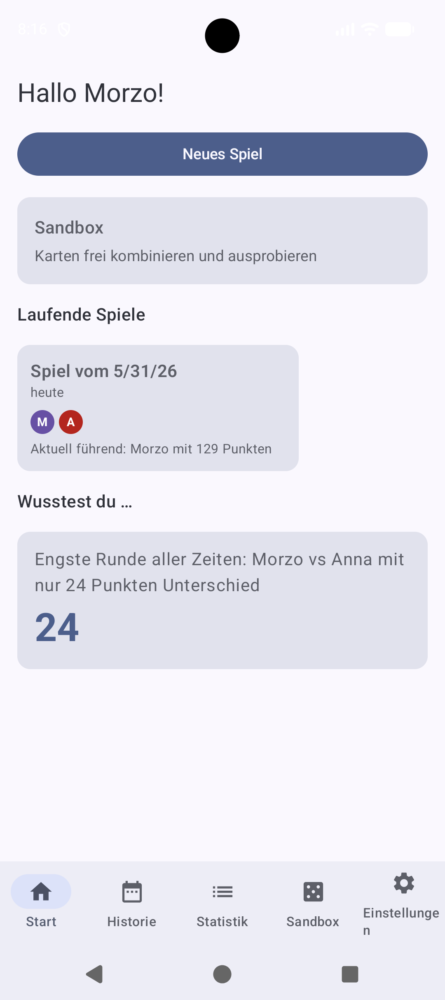
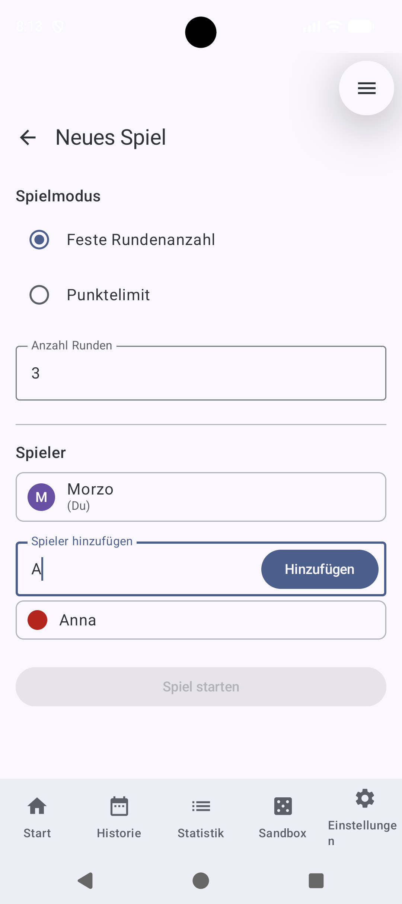
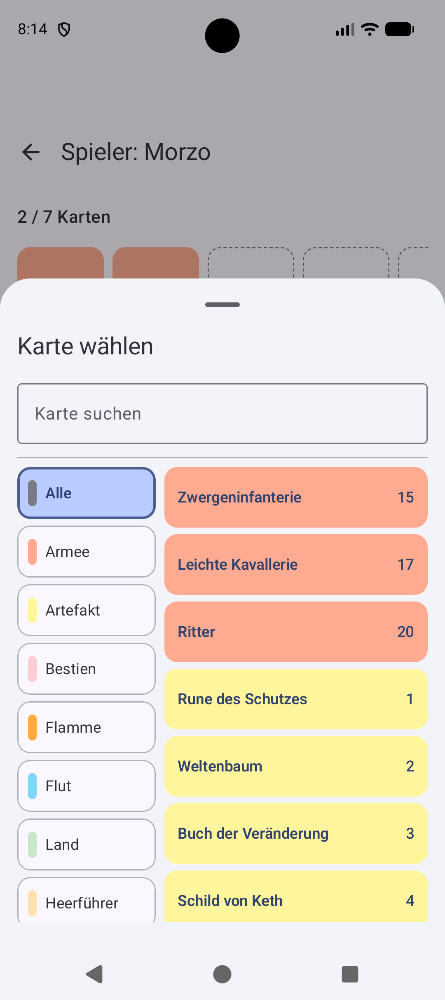
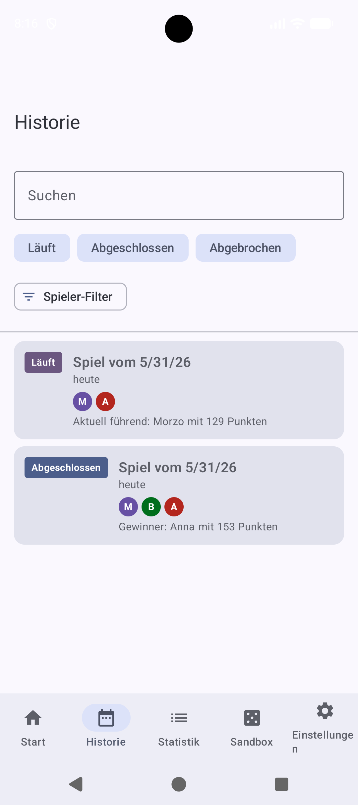

# RealmScore

**Offline-Punktezähler für *Fantasy Realms* / *Fantastische Reiche* — kostenlos, werbefrei, ohne Tracker.**

> Inoffizielle Fan-App. Steht in keiner Verbindung zu Strohmann Games, WizKids oder den Herausgebern des Spiels.

---

## Ist diese App das Richtige für mich?

| Ich … | Passt? |
|---|---|
| spiele Fantasy Realms / Fantastische Reiche regelmäßig und will keine Punkte mehr mit Stift & Papier erfassen | ✅ Genau dafür gebaut |
| will eine App, die mir die komplexe Punkteformel automatisch berechnet | ✅ Vollautomatisch inkl. Boni, Strafen, Blanking, Joker |
| mag den spannenden Moment wenn alle Hände gleichzeitig aufgedeckt werden | ✅ Reveal-Modus mit Animation |
| will Karten-Kombinationen vorab ausprobieren | ✅ Sandbox eingebaut |
| will langfristige Statistiken über meine Spielgruppe | ✅ Ausführliche Spieler- und Karten-Statistiken |
| brauche eine Cloud-Anbindung oder Online-Multiplayer | ❌ Rein offline, kein Internet nötig |
| spiele nur gelegentlich und brauche keine Auswertung | ⚠️ Funktioniert, aber der Mehrwert entfaltet sich über Zeit |
| habe ein iPhone | ❌ Nur Android |

---

## Screenshots

| Startbildschirm | Karten eingeben | Spannungs-Reveal | Statistiken |
|---|---|---|---|
|  |  |  |  |

---

## Features (aktueller Stand)

### Spielverwaltung

- **2–6 Spieler** pro Spiel
- **Zwei Spielmodi:** Feste Rundenanzahl *oder* Punktelimit (Rommé-artig — neue Runde bis jemand das Limit reißt)
- Mehrere Spiele **gleichzeitig offen** — einfach App verlassen und später weitermachen
- Spiel-Übersicht mit laufendem Gesamtstand über alle Runden

### Karten-Eingabe

- **Kartensuche** mit Suit-Filter (Army, Beast, Flame, Flood, Land, Leader, Magic, Wild, Wizard …)
- **Joker-Karten** werden vollständig unterstützt:
  - *Doppelgänger* — kopiert eine beliebige Karte aus der eigenen Hand
  - *Spiegelung* & *Gestaltenwandler* — können jede der 53 Karten imitieren
  - *Buch der Wandlungen* — wechselt den Suit einer Karte
  - *Totenbeschwörer* — holt eine Nicht-Magier-Karte aus dem Mittelfeld in die eigene Wertung (8. Karte)
- Eingabe ist **jederzeit korrigierbar**, solange keine neue Runde gestartet wurde

### Scoring-Engine

Die gesamte Fantasy-Realms-Regellogik ist implementiert — kein manuelles Nachschlagen mehr:

- **Automatische Boni** (z. B. König: +5 pro Armee-Karte; +20 mit Königin)
- **Automatische Strafen** (z. B. fehlende Karte in einer Bedingung)
- **Blanking-Effekte** — Drachen blanken Karten ohne Schwert oder Magie; geklärte Karten werden korrekt behandelt
- **Korrekte Reihenfolge:** Joker → Buch der Wandlungen → Totenbeschwörer → Strafen aufheben → Blanking → Boni → Strafen → Score
- **Optimal-Button** — berechnet die beste Joker-Belegung per Brute-Force (alle Kombinationen) für die aktuelle Hand
- **Aufschlüsselung** pro Karte: Basisstärke, Boni, Strafen, geblankt ja/nein, exakter Beitrag zum Gesamtscore

### Spannungs-Reveal

- Alle Spieler geben ihre Karten verdeckt ein — keiner sieht die Punkte der anderen
- **Reveal-Sequenz** mit Animation: Spieler werden von niedrigster zu höchster Punktzahl aufgedeckt, Punkte zählen hoch
- **Krone** für den Rundensieger
- Skip-Option wenn es schneller gehen soll
- Reveal lässt sich nachträglich nochmal ansehen

### Sandbox

- **Freies Kombinieren** aller 53 Karten ohne laufendes Spiel
- Live-Score-Update bei jeder Kartenänderung
- Detaillierte **Aufschlüsselung** welche Karte wie viel beisteuert
- Joker-Belegung manuell oder per **Optimal**-Solver
- Totenbeschwörer-Auswahl direkt in der Sandbox

### Statistiken

- **Globale Übersicht:** Gespielte Spiele, Runden, einzigartige Spieler
- **Spieler-Rangliste** sortiert nach Siegquote
- **Spieler-Detail:** Siegquote, Durchschnittspunkte, beste Einzelhand, Lieblingskarten, Score-Trend, Duell-Statistiken gegen jeden Gegner
- **Karten-Statistiken:** Wie oft wurde eine Karte gespielt, durchschnittlicher Beitrag, stärkster Einzelbeitrag, häufigste Kombi-Partner
- **Head-to-Head:** Detaillierter Vergleich zweier Spieler
- **Datenqualitäts-Hinweis** wenn Mittelfeld-Daten fehlen

### Datenschutz & Technik

- **Vollständig offline** — kein Internet, kein Account, keine Cloud
- **Keine Tracker**, kein Analytics, keine Werbung
- **F-Droid-konform** — keine Google Play Services, kein Firebase, kein ML Kit
- Alle Daten bleiben auf dem Gerät (Room-Datenbank)

---

## Geplante Features

Die folgenden Funktionen sind spezifiziert und werden in kommenden Versionen umgesetzt:

### Spieler & Verwaltung

- **Profilverwaltung** (Phase 17): Dedizierter Screen zum Umbenennen, Farbe ändern, Archivieren und Zusammenführen von Profilen. Archivierte Profile verschwinden aus der Auswahl, alle Spieldaten bleiben erhalten.

### Visualisierung

- **Karten-Ring-Diagramm** (Phase 18): Die 7 Handkarten werden als Ring angeordnet. Verbindungslinien zeigen, welche Karten sich beeinflussen — Grün für Boni, Rot für Strafen, Linienstärke proportional zur Effektstärke. Geblankte Karten werden grau dargestellt. Optimaler Layout-Algorithmus minimiert Kreuzungen. Verfügbar in der Sandbox und nach dem Reveal.

### Mittelfeld erfassen

- **Manueller Mittelfeld-Scan** (Phase 20): Der Discard-Pile kann per CardPicker manuell erfasst werden. Die Totenbeschwörer-Auswahl wird dann automatisch auf die erfassten Karten gefiltert, und der Optimal-Solver bezieht die Totenbeschwörer-Karte in seine Berechnung ein.
- **Kamera-Scan mit OCR** (Phase 21): Alle 7 Handkarten auf einmal fotografieren — die App erkennt die Kartennamen automatisch via Tesseract OCR. Bei sicherer Erkennung werden Karten direkt übernommen, bei Unsicherheit wählt der User aus Top-3-Kandidaten. Manuelle Eingabe bleibt immer als Fallback. Gilt für Spieler-Hände und das Mittelfeld. F-Droid-konform (kein ML Kit).

### Sandbox-Erweiterungen

- **Favoriten** (Phase 22): Interessante Karten-Kombinationen speichern und später per Tap wieder laden. Durchnummeriert, kein Name nötig.
- **Multi-Hand-Vergleich** (Phase 22): Zwei Hände nebeneinander im Split-Screen vergleichen — Score-Vergleich oben, Karten-Details in jeder Hälfte.

### Sprache

- **Englische Übersetzung** (Phase 19): Vollständige englische UI inkl. offizieller englischer Kartennamen aus der WizKids-Edition. Language-Switcher in den Settings (System / Deutsch / English).

### Daten

- **Backup & Export** (Phase 23): Vollständiges Backup aller Daten als JSON-Datei via Android Share-Intent. Import auf demselben oder einem anderen Gerät. Versioniertes Format, Duplikate werden beim Import automatisch übersprungen.

### Erweiterung "Der verfluchte Schatz"

- **+47 Karten** (Phase 24): Die Erweiterung wird über einen Settings-Toggle aktiviert. Erweiterungs-Karten erscheinen im CardPicker mit einem kleinen Badge und werden von der Scoring-Engine vollständig unterstützt.

### Gemeinsam am Tisch spielen

- **P2P-Synchronisation via NFC + Bluetooth** (Phase 25): Jeder Spieler tippt seine eigenen Karten auf seinem Gerät ein. Geräte verbinden sich per NFC-Handshake und Bluetooth RFCOMM — ohne Location-Permission, ohne Cloud. Live-Synchronisation der Spielerliste, Optimistic Locking wenn jemand gerade eingibt, Offline-Weiterspielen bei Verbindungsabbruch mit automatischem Resync. Am Spielende haben alle Geräte die vollständigen Daten lokal. Fallback-Code für Geräte ohne NFC.

---

## Installation

### Aus F-Droid (empfohlen)

> F-Droid-Listing folgt nach dem ersten Release. Bis dahin: APK-Download (siehe unten).

### APK direkt installieren

1. Unter [Releases](https://github.com/BastianSetter/realmscore/releases) die neueste `app-debug.apk` herunterladen
2. Auf dem Android-Gerät "Installation aus unbekannten Quellen" einmalig erlauben
3. APK installieren

Mindest-Android-Version: **Android 8.0 (API 26)**

### Selbst kompilieren

Voraussetzungen: JDK 21 (z. B. JBR aus Android Studio), Android SDK (compileSdk 36).

```bash
./gradlew assembleDebug
```

Die APK landet unter `app/build/outputs/apk/debug/`.

F-Droid-Konformitäts-Check (muss leer sein):

```bash
./gradlew :app:dependencies | grep -E "(gms|firebase|mlkit|google-services)"
```

---

## Tech-Stack

| | |
|---|---|
| Sprache | Kotlin 2.2, Compose Compiler Plugin |
| UI | Jetpack Compose + Material 3 |
| Datenbank | Room 2.7 |
| Einstellungen | DataStore Preferences |
| Navigation | AndroidX Navigation Compose |
| DI | Manuell via `AppContainer` (kein Hilt) |
| Build | Gradle Kotlin DSL + Version Catalog |
| Distribution | F-Droid-konform (keine proprietären Libs) |

---

## Lizenz

GPL-3.0-or-later. Siehe [LICENSE](LICENSE).

---

## Quellcode

https://github.com/BastianSetter/realmscore
